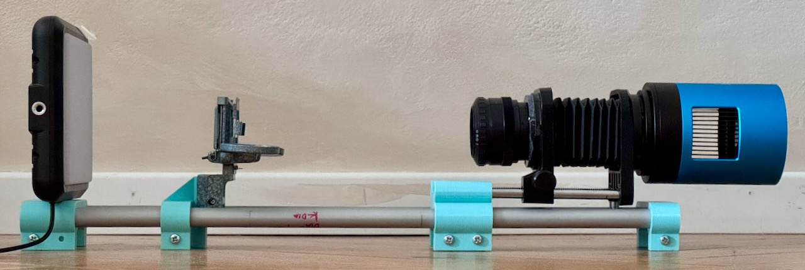

# FilmScan Studio



**Open-hardware, open-source digitisation of photographic film.** A DIY scanner
holder + duplicator transport, a true 16-bit linear monochrome camera, and
Python software that turns B&W negatives into physically calibrated digital
positives — and keeps every fact about the strip (film, development, dates,
GPS) attached to the pixels all the way into the exported JPEG/HEIC.

The sensor chain is treated as a **measurement instrument**: the Sony IMX571
runs its native 16-bit ADC, mono (no demosaic), no gamma, no auto-brightness —
what the stream measures is what the file holds. That lets the software compute
real **optical density** per pixel (`D = −log10 T`) instead of guessing at
curves, and it is what makes the result reproducible years later.

## The workflow — three commands, in this order

```bash
uv sync                        # install everything (Python 3.12 + uv)

uv run filmscan-studio         # 1. CAPTURE   — camera → 16-bit TIFFs + metadata
uv run filmscan-annotate       # 2. ANNOTATE  — titles, dates, GPS, film log
uv run filmscan-develop-gui    # 3. DEVELOP   — densities → tone curve → exports
```

### 1. Capture — `uv run filmscan-studio`

The capture GUI (PySide6, Czech UI) drives the camera and builds **one project
folder per film strip**. Inside the app, work through the boxes in this
sequence — each step produces calibration that the develop step needs:

1. **Nový film** — film metadata (stock, ID, developer, dates, orientation…).
2. **Dark Frame** — sensor dark current with the light path capped.
3. **Flat Field** — illumination without film (divides out vignetting/dust).
4. **Film base** ("min point") — a drag-rect over a patch of **clear film
   base**; this measured floor becomes Dmin in step 3. This is *not* the flat —
   the flat is shot without film, the base measures the held film itself.
5. **Capture** — frame by frame, auto-numbered to match the canister. Optional
   averaging of N exposures per frame; LCG + low-noise readout (the sensor
   optimum, see `camera_tests/`) are on by default. After every frame the TIFF
   is **audited** (metering rect on/off) and the next frame's shutter is
   corrected automatically.
6. **Exportovat projekt** — the folder is complete.

Stored per film: untouched **16-bit linear mono TIFFs** in `frames/`, one
`.tif.json` sidecar per frame (exposure, gain, temperature, calibration
provenance…), `catalog.sqlite`, `project.json`, `film_base.json`. Raw files
are copied, never rewritten — metadata never lives inside the TIFF.

Run `uv run filmscan-studio --mock` to explore the GUI with a simulated camera,
no hardware needed.

### 2. Annotate — `uv run filmscan-annotate [folder]`

Opens a captured project folder and lets you fill in what the camera cannot
know: title, description, star rating, tags, **capture date & time** (a
readable date on the film canister label is auto-applied to all frames,
sequentially offset by one minute each; bulk apply works the same way),
**GPS**, camera make/model, shooting lens, film ISO, developing chemicals,
push/pull, expiry, per-frame 90° rotation. Everything is written into the JSON
sidecars — the develop step reads it back and burns it into the exported
files' EXIF/XMP.

### 3. Develop — `uv run filmscan-develop-gui [folder]`

The "developer" opens the density archive and renders the **positive**
(bright scene = dense film = bright pixel). For each frame it computes:

```
raw DN ──dark──► flat ──► transmittance T ──► density D = −log10 T ──►
Dmin (from film-base measurement) ──► Dmax (auto p99.9, or manual) ──►
exposure EV ──► tone curve (toe · mid contrast γ · shoulder) ──►
display gamma 2.2 (defined by the ICC profile) ──► export
```

The tone-curve model is a Fritsch–Carlson spline filmic curve, designed with
[darktable's **negadoctor**](https://github.com/darktable-org/darktable) module
as the inspiration/checked counterpart (our own density-based take on it —
see `Documentation_image_processing/02_rozbor_negadoctor.md`).

**Tuning order** (full walkthrough in
[`Documentation_image_processing/08_ui_ladeni_dmin_dmax_a_krivky.md`](Documentation_image_processing/08_ui_ladeni_dmin_dmax_a_krivky.md)):
first the **film scale** (Dmin — leave it on *from film-base measurement*; Dmax
— start on *auto from frame*, tighten against the right edge of the density
histogram), then the **picture** (mid contrast γ ≈ 1.35–1.7, toe compresses
shadows, shoulder compresses highlights), and finally nothing — display gamma
2.2 is fixed by the export profile, not a creative control. The annotated
metadata (GPS, time, camera, developer…) flows into the export's EXIF/XMP
automatically. A `Shift`-drag draws the ROI (frame crop) that both preview and
exports respect; orientation flags from the capture are baked into the pixels.

A headless CLI also exists: `uv run filmscan-develop frame001.tif --dark … --flat … -o out/`.

### Export formats

Everything exports to `<project>/derived/`, named
`<FILMID>_frameNNN.<kind>` (e.g. `K16O04_frame001.mono10.heic`). The tone
curve lands in the pixels **exactly once**; ICC profiles are interpretation
wrappers, never a second gamma.

| Format | Suffix | Depth | Profile | For |
|---|---|---|---|---|
| Positive TIFF 16b gray | `.positive.tif` | 16-bit | Gray Gamma 2.2 | master positive, WYSIWYG with the preview |
| JPEG 8b gray | `.jpg` | 8-bit | Gray Gamma 2.2 | everyday viewing |
| JPEG 8b sRGB | `.srgb.jpg` | 8-bit | hand-built sRGB wrapper | readers that insist on colour |
| HEIF 10b mono | `.mono10.heic` | 10-bit | Gray Gamma 2.2 | Apple Photos, small + deep |
| HEIC 10b sRGB | `.srgb10.heic` | 10-bit | sRGB wrapper | Apple ecosystem, RGB for reader safety |
| Flat for Capture One | `.flat.tif` | 16-bit | **none** — linear in density | grading from scratch |
| Density archive | `.density.tif` | float32 | none — absolute optical D | the archival measurement; regenerates every row above |

EXIF + XMP (title, description, rating, GPS, dates, camera make/model, lens,
film ISO, developer, digitisation data…) are embedded in the JPEG and HEIC
exports; TIFFs keep their JSON sidecar instead. Any export is reproducible —
each carries a parameter fingerprint.

## Software branches

- **`main`** — built around the **TEC-cooled Touptek TS2600MP-G2** (Sony
  IMX571, APS-C **mono**, 6224×4168, native 16-bit ADC, USB3): the sensor
  optimum for **B&W 35mm** film — full well, no Bayer interpolation artefacts,
  no white balance to chase.
- **`D750`** branch (`git checkout D750`) — the same software driving a
  **Nikon D750** as the digitising camera through the Nikon SDK
  (`Nikon_SDK/`, driven from an x86_64 helper process).

## Hardware

| Part | What it is | Notes / source |
|---|---|---|
| Camera | Touptek TS2600MP-G2 (= ATR2600M), Sony IMX571 APS-C mono astro camera | 6224×4168 @ 16-bit USB3, two-stage TEC cooling to ΔT −42 °C, **needs 11–14 V DC power** |
| Digitising lens | Meopta Meogon-S 4/80 enlarging lens | |
| Bellows | "Macro Extension Bellows Lens Wrap Belt for Nikon F-Mount" | [AliExpress 1005010760273220](https://www.aliexpress.com/item/1005010760273220.html) — holds lens at copy distance |
| Light source | "8 Inch LED Photography Video Panel Light Photo Studio Lighting Kit" | [AliExpress 1005006408823817](https://www.aliexpress.com/item/1005006408823817.html) — the **middle brightness preset runs at 4440 K with the best homogeneity**; that preset is what we digitise with |
| Film holder | printed modification of **"35mm film DSLR digitizing rig"** by OndrejP_SK | Thingiverse [thing:4379458](https://www.thingiverse.com/thing:4379458); our SketchUp + STL modifications live in [`3Dmodels_scanner_holder/`](3Dmodels_scanner_holder) (incl. a 6×6 medium-format holder) |
| Film advance | **vintage diapositive duplicator** (a device for copying slide film / diapositives), most likely made by **Ihagee** | [reference](https://photobutmore.de/exakta/zubehoer/diakopier/index.php) — see the photo up top; the holder bolts where the duplicator held its slide carrier |
| Alternative camera | Nikon D750 via Nikon SDK | `D750` branch |

## Repository layout

```
src/filmscan_studio/
  __main__.py        filmscan-studio      — capture GUI entry point
  capture/           camera backends: Touptek SDK wrapper (_toupcam/, vendored dylib),
                     mock camera, capture session, post-capture quality audit
  core/              the physics + imaging core, shared by both GUIs:
                     calibration (dark/flat), density (T→D archive), render
                     (tone curve), filmic, icc (profiles), exportmeta (EXIF/XMP),
                     filmbase, histogram, zoom, models (pydantic metadata schema)
  gui/               capture GUI widgets (PySide6)
  annotator/         filmscan-annotate    — metadata annotator GUI
  developer/         filmscan-develop[-gui] — density archive, develop pipeline, GUI
tests/               pytest suite (598 tests, runs against MockCamera — no hardware)
Documentation_image_processing/
                     01–09 design docs: physical model, negadoctor analysis,
                     rendering layers, ROI, ICC/histograms, Dmin/Dmax/curve UI
                     guide, annotation & EXIF contract — start with its README
3Dmodels_scanner_holder/   SketchUp + STL models modifying the Thingiverse rig
camera_tests/              sensor characterisation scripts (LCG/HCG × low-noise SNR,
                           averaging, min exposure, temperature) + result plots
Nikon_SDK/                 Nikon SDK payload (D750 branch)
Touptek_SDK/               vendor SDK distribution (the used dylib is vendored
                           inside src/filmscan_studio/capture/_toupcam/)
scripts/                   hardware probe helpers (cooling, manual film-base probe)
Documentation_image_processing/darktable_source/   frozen negadoctor sources (GPLv3)
AGENTS.md                  contributor/agent rules: design invariants, retired features
CHANGELOG.md               what changed, by date
```

## Requirements & installation

- [uv](https://docs.astral.sh/uv/) and Python ≥ 3.12 (uv fetches it), then
  `uv sync` — installs PySide6, numpy, OpenCV, Pillow, pillow-heif, tifffile,
  pydantic. No downloads for either camera SDK: both are vendored in the repo.
- **Touptek SDK dependency:** the capture backend is the official
  [Touptek/ToupCam SDK](https://www.touptek-astro.com/downloads/?atfWidgetNav=box_sdk)
  (ctypes wrapper + native library). The exact copy in use — SDK
  **20260908** (`toupcam.py` v60.32549, universal `libtoupcam.dylib`) — is
  vendored, unmodified, under
  [`src/filmscan_studio/capture/_toupcam/`](src/filmscan_studio/capture/_toupcam/);
  updates come from the vendor download page above.
- Camera: a USB3 port and **11–14 V DC power** for the Touptek. Without power
  the camera may not enumerate on USB at all.
- macOS is the development platform (the vendored dylib is universal
  x86_64+arm64); Linux/Windows packaging is planned.
- Tests: `uv run pytest` (598 tests, `--mock` camera — no hardware needed).

## Troubleshooting

| Symptom | Cause / fix |
|---|---|
| Camera never appears on USB | The 11–14 V supply is missing — power first, then plug USB in |
| Live view too coarse up to 3× zoom | Intentional: the everyday stream is a 3×3-binned whole-sensor overview (honest for metering); ≥3× display zoom switches the sensor to a true 1:1 hardware ROI |
| Export warns "scan has no dark within ±0.5 °C" | Dark subtraction on a cooled sensor only holds in a narrow temperature window — let the TEC settle (green semaphore) and re-shoot darks |
| HEIC/JPEG look solarized in some reader | Use the shipped exports as-is — the ICC profiles are built to survive macOS ColorSync *and* lcms2 (see `tests/test_icc.py`); don't round-trip them through readers that rewrite profiles |
| A frame renders all-white / "no film" | Density ≈ 0 everywhere usually means the holder was empty for that frame |

## Documentation & status

- `Documentation_image_processing/README.md` — index of the nine design docs
  (physical measurement model → negadoctor math → rendering layers → UI guide →
  EXIF contract). Doc **08** is the user-side developing procedure; docs
  **01–03** explain how the conversion works.
- `AGENTS.md` — the invariants the code enforces and the features deliberately
  retired (read before contributing).
- Test suite: 598 tests green against MockCamera; real-hardware verification
  checklist lives in `INSTRUCTIONS_TOUPTEK_CAMERA.md` §11.
